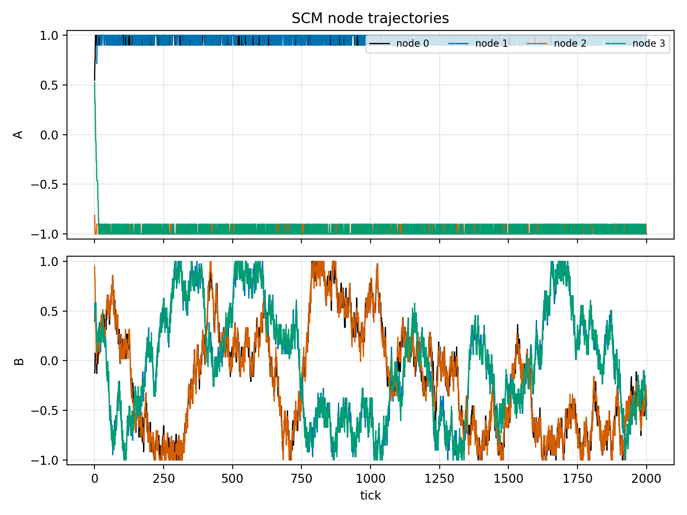

<!-- Written by Richard Christopher, Copyright 2026 NeoTec Digital -->
# StableChaos


[](LICENSE.md)



Two coupling mechanisms, one phenomenon. **Antagonistic (opposition) coupling** alone freezes a
system into rigid order; **imitative (likeness) coupling** alone collapses it into wandering
consensus. Acting together they produce bounded, persistent, non-converging dynamics — trajectories
that never settle to a fixed point yet never diverge, with high state-space occupancy entropy. This
repository formalizes that observation into two composable models: the **Stable Chaos Model** (a ring
of dipole nodes) and the **Tranception phase lattice** (a frustrated Kuramoto lattice), with a
reproducible paper, figures, tests, and demos.

> All of my ideas, converging into one.

The term "stable chaos" is used operationally here (bounded, aperiodic, high occupancy) and is
related to the established stable-chaos of Politi and Torcini; see [`paper/`](paper/) and
[`docs/THEORY.md`](docs/THEORY.md).

## Install

```bash
pip install -e .          # users: library + demos
pip install -e '.[dev]'   # development/testing: also installs pytest
```

The `[dev]` extra is required to run the [test suite](#testing).

## Quickstart

```python
from stablechaos.scm import StableChaosModel, SCMConfig
from stablechaos.viz.figures import fig_scm_phase_portrait

model = StableChaosModel(SCMConfig(n_nodes=4, seed=42))   # build
traj = model.run(2000)                                     # run
fig_scm_phase_portrait(traj, out="phase_portrait")         # plot -> phase_portrait.pdf/.png
```

## Demos

| Demo | What it shows | Headless example |
| --- | --- | --- |
| `demos/scm_demo.py` | Ring of dipole nodes attracting/opposing into stable chaos | `python demos/scm_demo.py --headless --ticks 500` |
| `demos/lattice_demo.py` | Frustrated phase lattice: 3-D polar frustration vs 2-D synchronization | `python demos/lattice_demo.py --headless --size 6 --dim 3 --k-polar -1.0` |
| `demos/waves_demo.py` | Phasor superposition, phase vs group velocity (writes `wave_superposition.pdf/.png` and `wave_phase_group.png`) | `python demos/waves_demo.py --out demos/output` |
| `demos/generate_figures.py` | Rebuilds every figure used by the paper | `python demos/generate_figures.py` |

The lattice demo also runs as the 2-D visual, synchronizing case — `python demos/lattice_demo.py --size 16
--dim 2 --k-polar -1.0` — where the polar orientation class is empty (the demo prints a note saying so), so
`--k-polar` has no effect and the field simply synchronizes.

Each demo defaults to `--seed 42` and writes to `demos/output/` (gitignored). `scm_demo.py` and
`lattice_demo.py` take `--headless` and exit `0` after saving a PNG; `waves_demo.py` is headless by default
(Agg backend) and saves its figures to the `--out` directory unless `--show` is passed.

## Repository structure

```
StableChaos/
├── stablechaos/          # library (no pygame in core)
│   ├── state.py          # dipole state algebra
│   ├── scm.py            # Stable Chaos Model (ring)
│   ├── metrics.py        # variance, occupancy entropy, order parameter
│   ├── lattice.py        # orientation classes + neighborhoods
│   ├── oscillator.py     # frustrated Kuramoto phase lattice
│   ├── waveform.py       # exact phasor waveform algebra
│   └── viz/              # matplotlib figures + pygame viewer
├── demos/                # runnable entry points
├── tests/                # pytest suite
├── paper/                # stable_chaos.tex + figures/
├── docs/                 # THEORY.md, LEGACY.md
└── web/                  # browser particle-life demo
```

## The paper

The write-up lives at [`paper/stable_chaos.pdf`](paper/stable_chaos.pdf). To rebuild it from source,
regenerate the figures first, then compile:

```bash
python demos/generate_figures.py   # writes paper/figures/*.pdf and *.png
cd paper && make                   # runs pdflatex twice -> stable_chaos.pdf
```

## Testing

Requires the `[dev]` extra (`pip install -e '.[dev]'`), which provides `pytest`:

```bash
MPLBACKEND=Agg PYTHONPATH=. pytest -q
```

## Citation

```bibtex
@techreport{christopher2026stablechaos,
  title       = {Stable Chaos: Bounded Persistent Dynamics from Antagonistic and Imitative Coupling},
  author      = {Christopher, Richard I.},
  institution = {NeoTec Digital},
  year        = {2026}
}
```

## License

Released under the **Ancillary License**: free to use, modify, and repurpose, with commercial
exploitation reserved to the author absent prior written agreement. Full terms in
[`LICENSE.md`](LICENSE.md).
